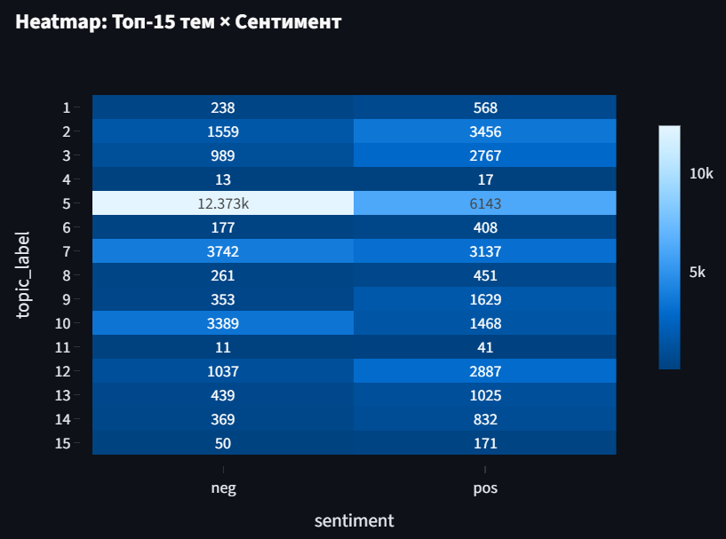

# Отчёт: Тематический анализ и сентимент отзывов

## 1. Датасет
- Взят датасет IMBD с отзывами на фильмы
- Объём: 50 тыс отзывов поровну разделённые на pos и neg.
- Поля: text, sentiment, split, review_id
- [Проведена предобработка текста](src/preprocess.py)

## 2. Тематическое моделирование
### 2.1 LDA
- Число тем: взято 15
- [Визуализация LDA](data/artifacts/lda_vis.html)

### 2.2 BERTopic
- Базовая модель эмбеддингов: `all-MiniLM-L6-v2`.
- Кол-во тем выделено: 465.
- [Визуализация BERTopic](data/artifacts/bertopic_topics.html)

## 3. Сентимент-анализ
- Подход: эмбеддинги + Logistic Regression.
- Метрики на hold-out: precision/recall/F1 по классам.

## 4. Дашборд
- [Ссылка на дашборд](http://localhost:8501/)
- В дашборде представлены распределения по темам, данных и heatmap тема × сентимент для каждого из методов тематического моделирования.
- Так же есть возможность протестировать свой отзыв.

## 5. Инсайты
Рассмотрим распределения каждого из методов.
### 5.1 LDA

- Преобладающе негативными являются 5 и 10 тема.
- Снизу пример из [визуализации](data/artifacts/lda_vis.html) для темы 10.

- Здесь видно, что тема связана с военной темой, видимо тема, которая мало кого оставляет равнодушным.
- 5 же тема похоже относится к оскаровским фильмам, где много и хороших отзывов, но и много недовольных тем, почему этот фильм выбрали на оскаре или чем он заслужил награду.
- Также достаточно неоднозначная тема 7, связанная с фильмами про расизм.
- Среди же отзывов с преобладающими положительными отзывами выделяются такие темы: (2)документальные фильмы, (3)хорроры, (9)диснеевские фильмы, (12) музыкальные и детективные фильмы.

### 5.2 BERTopic

- Стоит отметить, что этим методом лучше выделяются определённые темы.
- Всех их можно посмотреть на [визуализации](data/artifacts/bertopic_topics.html)
- Положительными можно выделить темы про 
5(детский дисней),6(романтика),10(фильмы про кунгфу),12(французские),13(фильмы адаптации игр)
- Негативными же 0(сами по себе ужасные фильмы),7(киллеры и копы),8(фильмы адаптации книг),9(религиозные)

